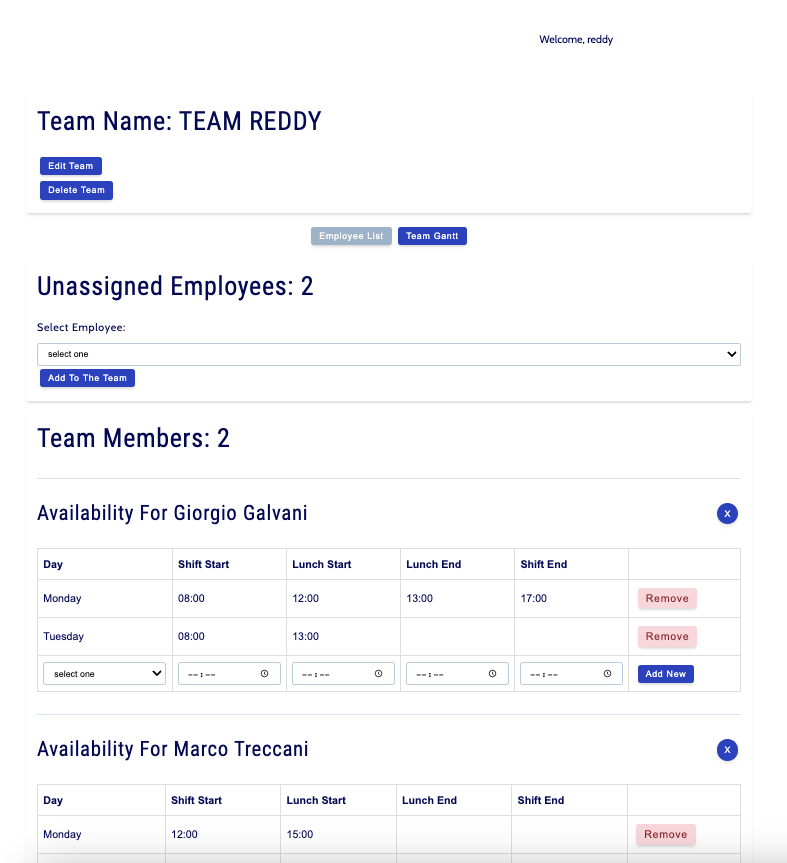
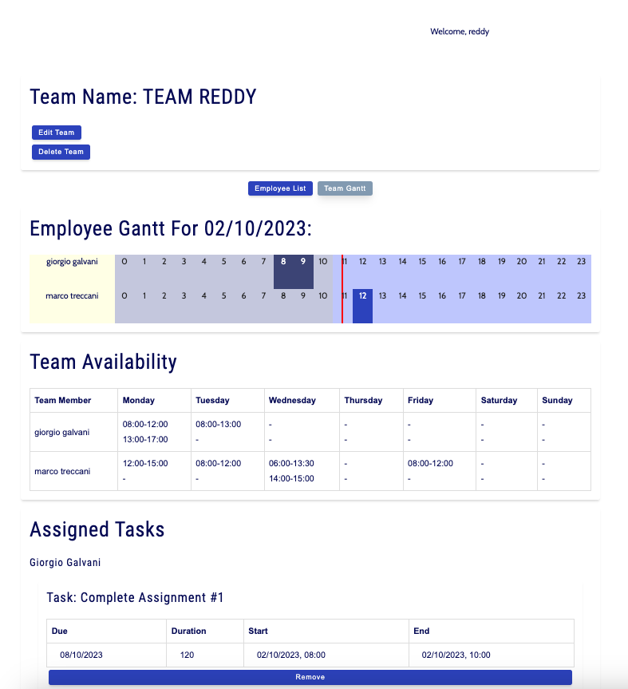
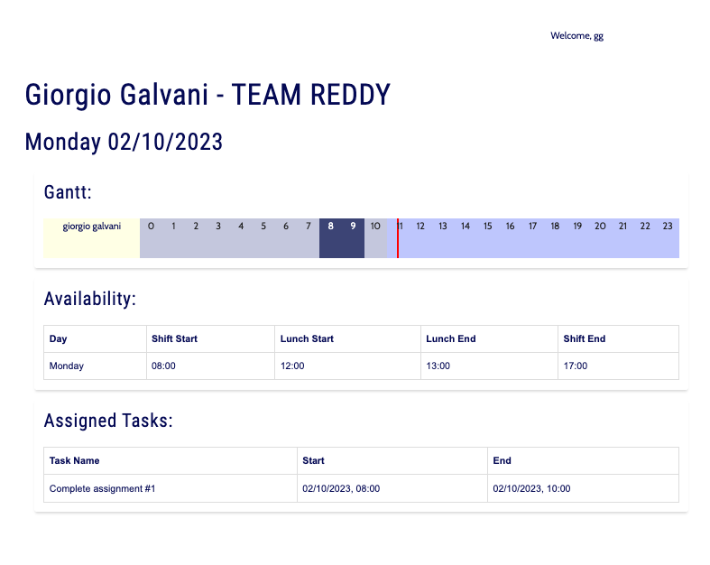

# TaskFlow

TaskFlow is an app to manage your team work.
The Team Leader can create tasks and assign them to team members on a week-calendar.

[Planning Document](https://github.com/spencerlelswick/task-flow/blob/feature/time-fix/docs/planning.md)

[Live app](https://task-flow-prod.netlify.app/)

## Features

### Manager

- Create, edit, delete a Team
- Assign available employee to his team, remove them from the team
- For each employee on the team set daily availability
- Create tasks with a due date and estimated duration
- Assign task to a user on a selected day, if user has enough availibility set for that day
- Display a list of unassigned task, display lists of assigned tasks filtered by employee
- Display weekly availability of the team
- Display the assigned tasks for the current day in a gantt

### Employee

- Display the daily availability
- Display the assigned tasks for the current day in a gantt

# Screenshots

## Manager View

### Team management

### Task managment - Gantt

## Employee View

## Technologies Used

### React / Django Full Stack Application

- HTML
- CSS
- JS
- Styled Components
- React
- Django
- Postgres
- PSQL
- Heroku
- Netlify

## Icebox Features

- [ ] Refactor Gantt Chart to have by-the-minute updates
- [ ] Access a report when a user pauses a task due to an issue
- [ ] Add a Dashboard to display information about task completion, percentage completed on time, percentage completed early, etc.
- [ ] Add a more dynamic data table for tasks with sorting and filtering
- [ ] Notify manager when a task is past due, or warn when approaching due date
- [ ] Color tasks on the Gantt chart
- [ ] Drag and drop tasks onto the Gantt
- [ ] Real time updates for Gantt chart, when employees change task status
- [ ] Flashing Icons for tasks paused that are approaching due date
- [ ] Notify manager on task status change due to employee pause
- [ ] Display a day-view version of the Gantt chart in employee view
- [ ] Condense Gantt view to earlier employee start time, and latest employee end time to display only active team working hours
- [ ] Allow managers to view the task log for research
- [ ] Allow managers to click a task on the Gantt chart for more information and controls
