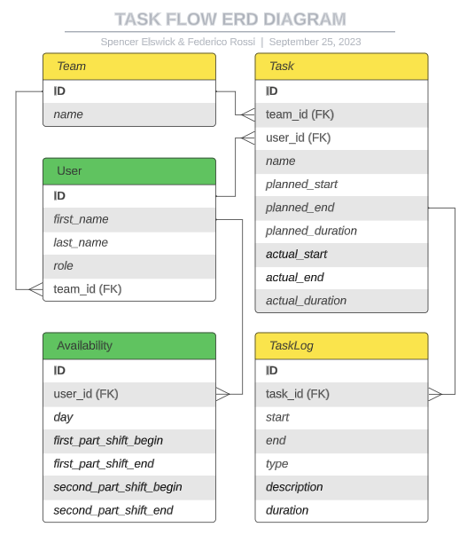

# TaskFlow

## Project Summary:

TaskFlow is a task management application for team leaders to plan workload.

Team leaders may create and assign tasks to team members with a designated start time and duration. Tasks then can be viewed by week in a Gantt style view.

Team members will have the ability to start, pause and end tasks. This will trigger the appropriate adjustments to their schedule automatically as tasks are completed earlier or later than planned. Team members can view their tasks in a day-schedule style view.

### Team Members:

1. Spencer Elswick
2. Federico Rossi

## Roles:

- Frontend - Spencer / Federico
- Backend - Spencer / Federico
- Design - Spencer / Federico

## Links:

[GitHub-Repository](https://github.com/spencerlelswick/task-flow)

[Trello Board](https://trello.com/b/xMXMnD0A/task-schedule-app)

[Wireframe](https://www.figma.com/file/Bf50uEc6ic4gEqv0o3ixuG/TaskFlow-Wireframe?type=design&node-id=0-1&mode=design&t=FGajHYo4nXgcI6EL-0)

## ERD Diagram

## Component Tree

## User Stories

### AS A USER

- AAU: I want to register as a user
- AAU: I want to request access to a role, either manager or employee
- AAU: I want to be able to login as a Manager or as an Employee

###### AS A MANAGER

- AAM: I want to be able to create a team
- AAM: I want to be able to approve an employee's request to join the team
- AAM: I want to set the employee core availability schedule
- AAM: I want to see the team calendar in a Gantt view
- AAM: I want to create a task with a duration
- AAM: I want to edit a Task
- AAM: I want to assign the Task to an Employee on a given date and time
- AAM: I want to see a list of created but unassigned tasks

###### AS AN EMPLOYEE

- AAE: I want to be able to see my schedule for the day
- AAE: I want to see the task assigned to me for the day

## Icebox Stories

###### AS AN EMPLOYEE

- AAE: I want to notify management when an issue occurs with a task

###### AS A MANAGER

- AAM: I want to be able be notified when a task changes status
- AAM: I want to be able be notified when a task has an issue raised
- AAM: I want to be able to customize the color of the task
- AAM: I want to be able to sort unassigned tasks
- AAM: I want to be able to be alerted if an unassigned task is past due
- AAM: I want to be able to be warned if an unassigned task is approaching its due date
- AAM: I want to reassign an task to a different Employee
- AAM: I want to assign them to drag and drop tasks
- AAM: I want to see in real time task status changes
- AAM: I want to task colors change based on status
- AAM: I want to be able to see on the Gantt view if an assigned task is past due date (danger color on the calendar or an icon flashing)
- AAM: I want to access a report about the tasks with timestamps of user operations: start time, end time, problem description
- AAM: I want to see a dashboard with stats about my team, my schedule, my tasks
